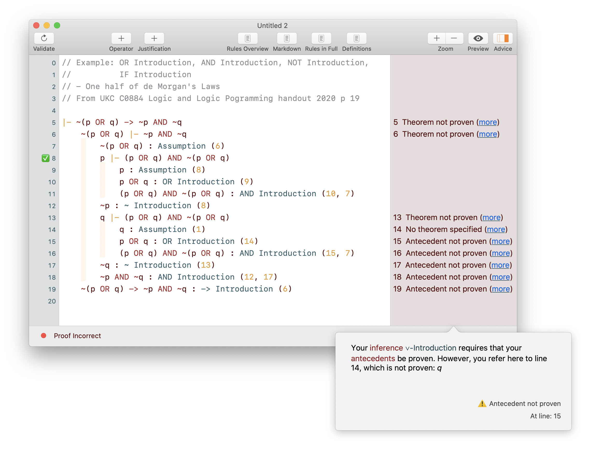
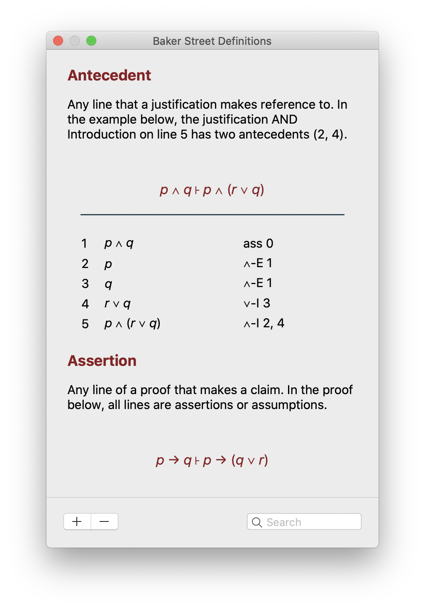
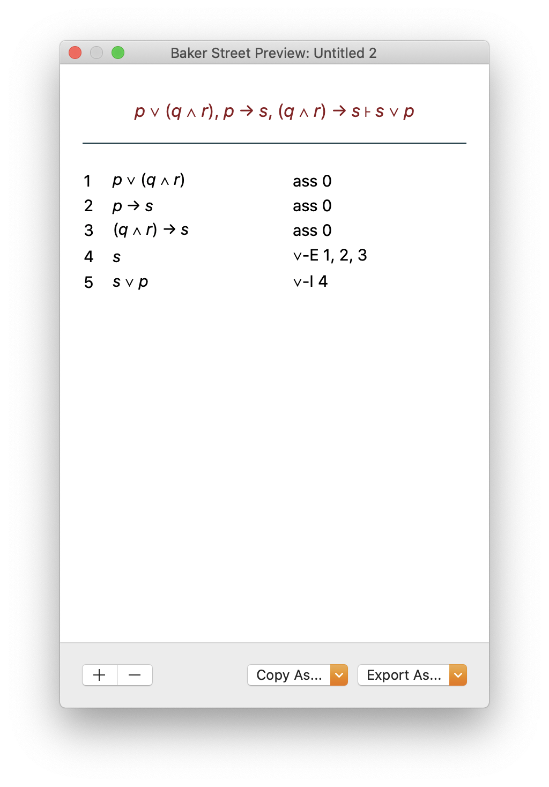
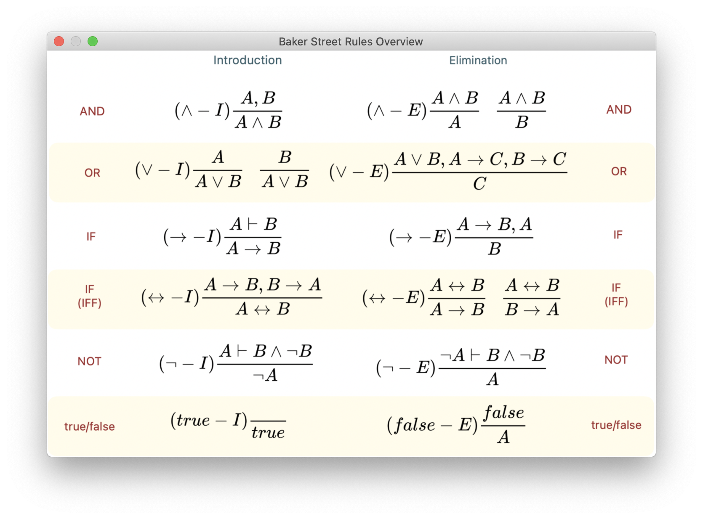
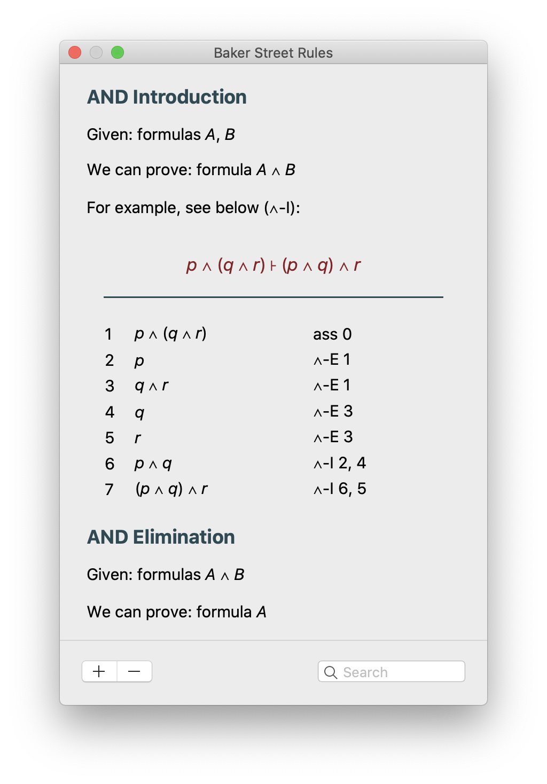

# Baker Street

## Overview

Available for macOS 10.12+, Baker Street is a free-form tool that helps you produce 
natural deduction proofs in propositional logic. Use Baker Street to enter your proof, 
check for errors, clarify relationships between proof lines, preview, and export your proof 
in several formats.

Type your proof in a free-form manner. Baker Street provides automatic line
numbering and feedback to help you see where you've gone wrong.

Baker Street is great for creating new proofs, inspecting sample proofs, and
exporting them to a variety of formats, all within a native macOS experience.

Baker Street was developed by Ian Hocking under the supervision of Dr Olaf Chitil at the
School of Computing, University of Kent, UK, as an MSc Computer Science summer project.

**[Download from the App Store](https://apps.apple.com/gb/app/baker-street/id1528304157)**

## Key Features

- Proof validation

- Syntax highlighting

- Tailored error messages designed to get you on track

- Add text comments to your proof

- One-touch insertion of logical operators and inference rule justifications

- Preview your formatted proof while typing in a lightweight markup language

- Export or copy your preview to LaTeX, Markdown or HTML

- Zoom support for all windows

- Dark mode support

- Example proofs for all inference rules (e.g. AND Introduction)

- Further help on:

  - Inference rules (in overview and in detail)

  - Key term definitions (e.g. theorem)

## Dissertation

I wrote the first draft of this application in the summer of 2020 as part of my master's [dissertation](dissertationHocking.pdf).

## Screenshots

### Definitions Reference

View a scrollable pop-up window with definitions and examples.

### Preview

Preview your proof with scope-based visual line numbering. Copy/export in various formats.

### Inference Rules: Overview

Refer to an overview of inference rules.

### Inference Rules: In Detail

The rules are also provided in detail.

## Licence

This project is licensed under the MIT License - see the [LICENSE](https://opensource.org/licenses/MIT) for details.

Permission is hereby granted, free of charge, to any person obtaining a copy of this software and associated documentation files (the "Software"), to deal in the Software without restriction, including without limitation the rights to use, copy, modify, merge, publish, distribute, sublicense, and/or sell copies of the Software, and to permit persons to whom the Software is furnished to do so, subject to the following conditions:

The above copyright notice and this permission notice shall be included in all copies or substantial portions of the Software.

THE SOFTWARE IS PROVIDED "AS IS", WITHOUT WARRANTY OF ANY KIND, EXPRESS OR IMPLIED, INCLUDING BUT NOT LIMITED TO THE WARRANTIES OF MERCHANTABILITY, FITNESS FOR A PARTICULAR PURPOSE AND NONINFRINGEMENT. IN NO EVENT SHALL THE AUTHORS OR COPYRIGHT HOLDERS BE LIABLE FOR ANY CLAIM, DAMAGES OR OTHER LIABILITY, WHETHER IN AN ACTION OF CONTRACT, TORT OR OTHERWISE, ARISING FROM, OUT OF OR IN CONNECTION WITH THE SOFTWARE OR THE USE OR OTHER DEALINGS IN THE SOFTWARE.
