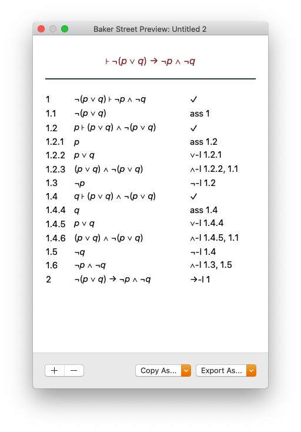

# Baker Street

## Overview

Available for macOS (10.12 -), Baker Street is a free-form tool that helps you produce 
natural deduction proofs in propositional logic. Use Baker Street to enter your proof, 
check for errors, clarify relationships between proof lines, preview, and export your proof 
in several formats.

Type your proof in a free-form manner. Baker Street provides automatic line
numbering and feedback to help you see where you've gone wrong.

Baker Street is great for creating new proofs, inspecting sample proofs, and
exporting them to a variety of formats, all within a native macOS experience.

Baker Street was developed by Ian Hocking under the supervision of Dr Olaf Chitil at the
School of Computing, University of Kent, UK, as an MSc Computer Science summer project.

## Key Features

- Proof validation

- Syntax highlighting

- Tailored error messages designed to get you on track

- Add text comments to your proof

- One-touch insertion of logical operators and inference rule justifications

- Preview your formatted proof while typing in a lightweight markup language

- Export or copy your preview to LaTeX, Markdown or HTML

- Zoom support for all windows

- Dark mode support

- Example proofs for all inference rules (e.g. AND Introduction)

- Further help on:

  - Inference rules (in overview and in detail)

  - Key term definitions (e.g. theorem)

## Screenshots

### Definitions Reference

View a scrollable pop-up window with definitions and examples.

### Preview

Preview your proof with scope-based visual line numbering. Copy/export in various formats.

### Inference Rules: Overview

Refer to an overview of inference rules.

### Inference Rules: In Detail

The rules are also provided in detail.

## Licence

MIT
